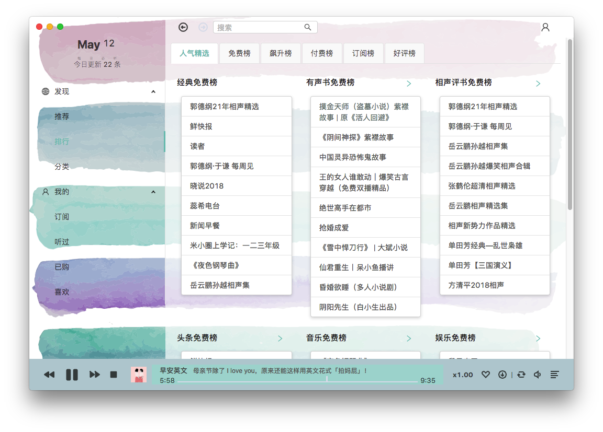
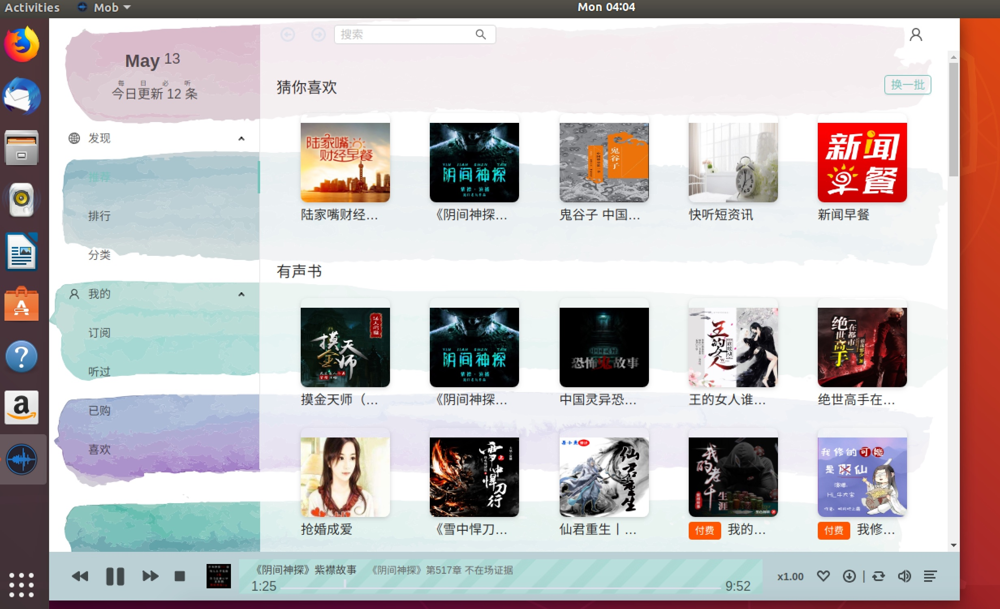

> Mob(モブ), the protagonist of the [モブサイコ 100](https://www.bilibili.com/bangumi/media/md5058)

【[中文 README](https://github.com/zenghongtu/Mob/blob/master/README.md)】

[](https://github.com/zenghongtu/Mob/releases)

[](https://travis-ci.org/zenghongtu/Mob) [](https://camo.githubusercontent.com/367dc8fdf5ea8444dd116c43c7900d9a1b1e9862/68747470733a2f2f696d672e736869656c64732e696f2f6769746875622f6c6963656e73652f7472617a796e2f69656173654d757369632e7376673f7374796c653d666c61742d737175617265)

> Built by [Electron](https://github.com/electron/electron), [Umi](https://github.com/umijs/umi), [Dva](https://github.com/dvajs/dva), [Antd](https://github.com/ant-design/ant-design)

## Preview


## Screenshots

### Mac




### Linux



### Win


## Feature

- [x] a music player
- [x] daily listen
- [x] recommend
- [x] rank
- [x] category
- [x] subscribed
- [x] listened
- [x] download track
- [x] search album
- [x] custom global shortcuts

## Next features:

- [ ] join [Himalaya podcast](https://www.himalaya.com/) api
- [ ] multi-language
- [ ] custom style
- [ ] keyboard shortcuts settings
- [ ] download history
- [ ] local music
- [ ] play record
- [ ] album review
- [ ] multiple tracks join lists

## Install

[**Here**](https://github.com/zenghongtu/Mob/releases/latest) to download the last version or below.

### Mac(10.9+)

[Download](https://github.com/zenghongtu/Mob/releases/download/v0.1.3/Mob-0.1.3-mac.dmg) the `.dmg` file, Or use `homebrew`:

```
brew cask install mob
```

### Linux

[Download](https://github.com/zenghongtu/Mob/releases/download/v0.1.2/Mob-0.1.2-linux-amd64.deb) the `.deb` file for 'Debian / Ubuntu':

```
$ sudo dpkg -i Mob-0.1.2-linux-amd64.deb
```

[Download](https://github.com/zenghongtu/Mob/releases/download/v0.1.2/Mob-0.1.2-linux-x86_64.AppImage) the `.Appimage` file for other distribution:

```
$ chmod u+x Mob-0.1.2-linux-x86_64.AppImage
$ ./Mob-0.1.2-linux-x86_64.AppImage
```

### Windows

[Download](https://github.com/zenghongtu/Mob/releases/download/v0.1.2/Mob-0.1.2-win.exe)

## Keyboard shortcuts

### Default Global

| Description  | Keys                                                               |
| ------------ | ------------------------------------------------------------------ |
| pause / play | <kbd>Cmd / Ctrl</kbd> + <kbd>Option / Alt</kbd> + <kbd>S</kbd>     |
| vol+         | <kbd>Cmd / Ctrl</kbd> + <kbd>Option / Alt</kbd> + <kbd>Up</kbd>    |
| vol-         | <kbd>Cmd / Ctrl</kbd> + <kbd>Option / Alt</kbd> + <kbd>Down</kbd>  |
| prev         | <kbd>Cmd / Ctrl</kbd> + <kbd>Option / Alt</kbd> + <kbd>Left</kbd>  |
| next         | <kbd>Cmd / Ctrl</kbd> + <kbd>Option / Alt</kbd> + <kbd>Right</kbd> |

## Development

```
$ yarn install
$ yarn run start:main
$ yarn run start:renderer
```

## CONTRIBUTING

## Communication


## FAQ

- [Issues](https://github.com/zenghongtu/Mob/issues)

## Related

- [zenghongtu/ximalaya-audio](https://github.com/zenghongtu/ximalaya-audio)

## License

MIT © [zenghongtu](https://github.com/zenghongtu)
